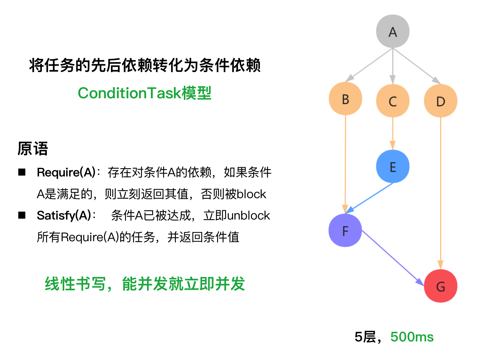
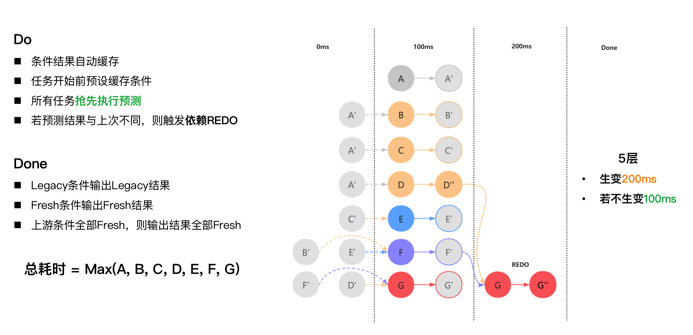

待重构

## ConditionGroup

条件依赖模型， 有点类似于pub/sub模型，但对于条件而言，只有满足与不满足。
条件满足后，所有对该条件的引用全部不会阻塞，且一定成功，不用像pub/sub模型中先行订阅。

## Sudu

Sudu，用于将存在条件依赖的并发调用，利用cache机制将依赖解开，变成并发调用，
核心需要处理的，则是依赖条件值的legacy问题。
使用legacy的值抢先进行预测，当依赖的条件由legacy状态转变为unlegacy时，
对应抢先预测的任务需要检查自身刚做完的结果是否有必要重做，
自身是否也受到unlegacy影响，也应当转变为unlegacy状态。

